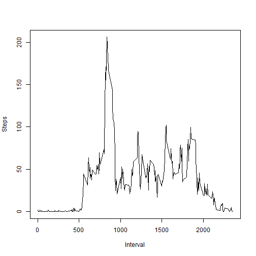

Reproducible Research Project 1
=========================================================================================================


First read the file and insert the data into a dataframe called stepdata:


```r
stepdata <- read.csv("activity.csv", sep = ",", header = TRUE)
```

## What is the mean total number of steps taken per day? 

The mean total number of steps taken per day:


```r
sumsteps <- aggregate(. ~ date, data = stepdata, FUN = sum)
hist(sumsteps$steps, xlab = "Steps", main = "Histogram of Steps")
```


```r
meansteps <- mean(sumsteps$steps)
mediansteps <- median(sumsteps$steps)
```

The mean steps per day is 1.0766189 &times; 10<sup>4</sup> and the median steps is 10765.

## What is the average daily activity pattern?


```r
stepinterval <- aggregate(steps ~ interval, stepdata, mean)
plot(stepinterval$interval, stepinterval$steps, type = "l", xlab = "Interval", ylab = "Steps")
```



Which 5-minute interval, on average across all the days in the dataset, contains the maximum number of steps?


```r
maxinterval <- stepinterval[which.max(stepinterval$steps),1]
```

The 835 interval contains the maximum number of steps.

## Imputing Missing Values

Calculate the number of NA values in the data set:

```r
numberofNA <- sum(is.na(stepdata))
```
There are 2304 NA values in the data set.

Impute missing data by average steps of each interval:

```r
imputedata <- transform(stepdata, steps = ifelse(is.na(stepdata$steps), stepinterval$steps[match(stepdata$interval, stepinterval$interval)], stepdata$steps))
newsumsteps <- aggregate(steps ~ date, imputedata, sum)
```

New histogram of total number of steps taken each day.

```r
hist(newsumsteps$steps, main = "Total Steps Each Day", xlab = "Number of Steps", col = "blue")
```


New mean and new median for imputed data:

```r
newmean <- mean(newsumsteps$steps)
newmedian <- median(newsumsteps$steps)
```

The new mean is 1.0766189 &times; 10<sup>4</sup> and the new median is 1.0766189 &times; 10<sup>4</sup>.  The old and new values are very close to each other.  So imputing data had a minimal effect on the previous data.


